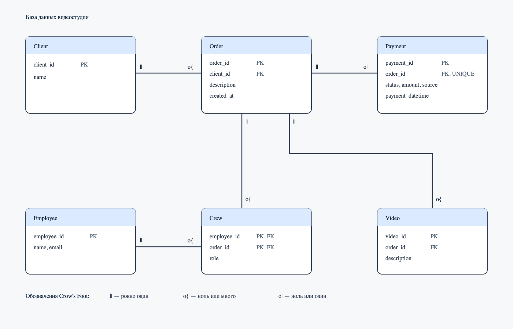

# HW1 — База данных видеостудии

## Как работает студия

Клиент оставляет заказ. Над ним могут работать несколько сотрудников,
по заказу можно подготовить несколько видео и оформить не более одной оплаты.

---

## Запросы реляционной алгебры

### 1. Источники успешных оплат

Получить источники успешных оплат.

```
π_{source} ( σ_{status='success'} (Payment) )
```

### 2. Сотрудники на заказах на свадьбу

Получить имена сотрудников, назначенных на заказы с описанием «свадьба».

```
π_{Employee.name} (
    ( Employee ⋈_{employee_id} Crew )
    ⋈_{order_id}
    π_{order_id} ( σ_{description='свадьба'} (Order) )
)
```

---

## ER-диаграмма


